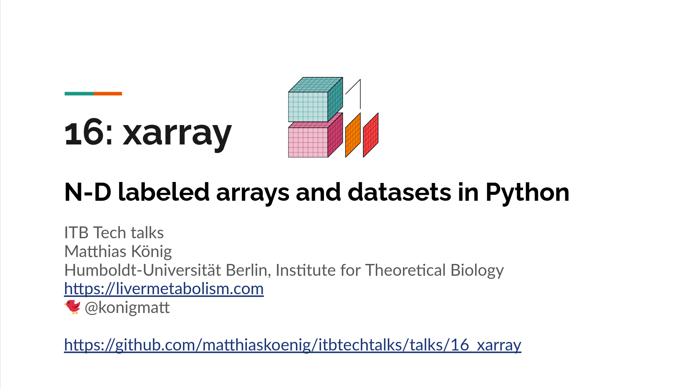
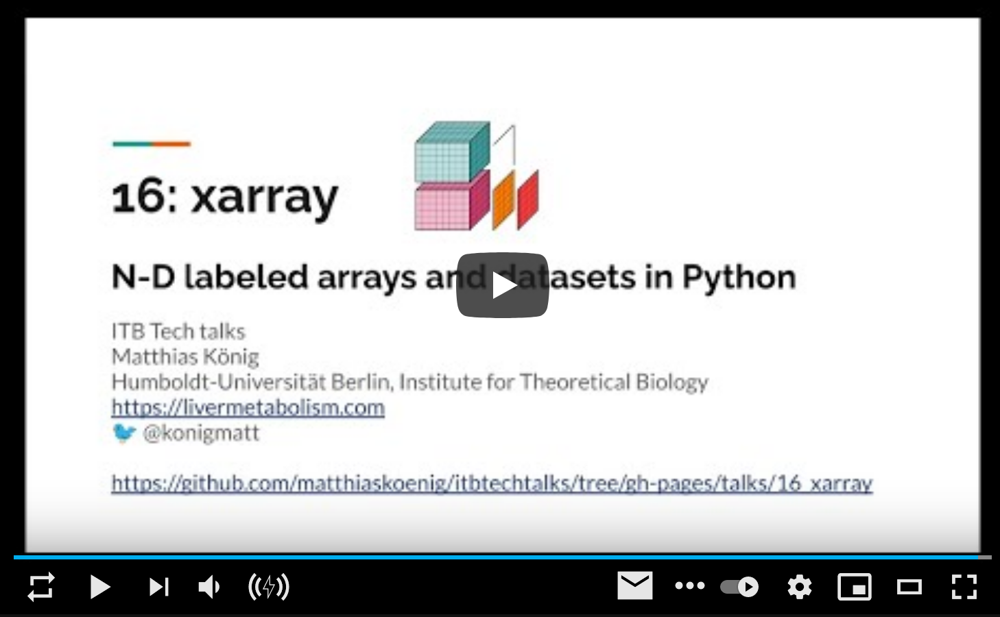

# ITB Tech Talks

Short talks introducing current technology and libraries (python/R) useful for Theoretical & Computational Biology.
This series is organized as part of the Seminar of the Institute of Theoretical Biology (ITB) at the Humboldt-University Berlin.

## Talks
- 18: [NetworkX - Network analysis in Python](./talks/18_networkx)
- 17: [fastapi - High performance easy to learn web framework](./talks/17_fastapi)
- 16: [xarray - N-D labeled arrays and datasets in Python](./talks/16_xarray)
- 15: [Streamlit - fastest way to build data apps](./talks/15_streamlit)
- 14: [The truth about t-SNE](./talks/14_tsne)
- 13: [SSH - Tips and tricks](./talks/13_ssh)
- 12: [What is docker?](./talks/12_docker)
- 11: [Multiprocessing](./talks/11_multiprocessing)
- 10: [Computer Latency at Human Scale](./talks/10_latency) 
- 9: [Introduction to machine learning with TensorFlow](./talks/09_tensorflow) 
- 8: [Plotting with matplotlib](./talks/08_matplotlib)
- 7: [SBML and libsbml](./talks/07_libsbml)
- 6: [Accessing web services with requests](./talks/06_requests) 
- 5: [Introduction to pandas](./talks/05_pandas)
- 4: [Template languages with jinja2](./talks/04_templates) 
- 3: [Jupyter notebooks](./talks/03_jupyter)
- 2: [Virtual environments in python](./talks/02_virtualenv) 
- 1: [A quick introduction to version control with git](./talks/01_git)

## Latest presentation & video

  

 

## Funding
Matthias König is supported by the Federal Ministry of Education and Research (BMBF, Germany)
within the research network Systems Medicine of the Liver (**LiSyM**, grant number 031L0054) 
and by the German Research Foundation (DFG) within the Research Unit Programme FOR 5151 
Qualiperf (Quantifying Liver Perfusion-Function Relationship in Complex Resection - 
A Systems Medicine Approach) by grant number 436883643.

For more information and contact see https://livermetabolism.com

&copy; 2018-2021 [Matthias König](https://livermetabolism.com)