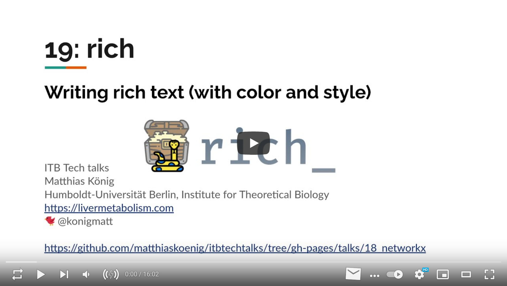

# Rich - writing rich text (with color and style)
## Presentation & video  
<a href="https://docs.google.com/presentation/d/e/2PACX-1vTj5LUc7ff340WAzh8DtZLuh-VWOosa9GhnZzeyjr5eflbdN0i7dPk7k7u-MDkVZ0iXDhq-7FT5Naoj/pub?start=false&loop=false&delayms=3000" target="_blank">
    
</a>
  
<a href="https://youtu.be/1e_iIcIen9s" target="_blank">
    
</a>

## Setup environment
To run the examples 
```
cd ./talks/19_rich
mkvirtualenv rich --python=python3
(rich) pip install -r requirements.txt
```
For detailed installation instructions see
https://rich.readthedocs.io/en/stable/introduction.html#installation

If you intend to use Rich with Jupyter then there are some additional dependencies 
which you can install with the following command:
```
pip install rich[jupyter]
```

Install the virtualenv as a kernel for the notebook
```
(rich) ipython kernel install --user --name=rich
```

## Features
Feature overview
```
python -m rich
```
Progress bars
```
python -m rich.progress
```

## Run example notebook
```shell
jupyter lab rich.ipynb
```

## Convert notebook to python script
```shell
ipython nbconvert --to python rich.ipynb
```