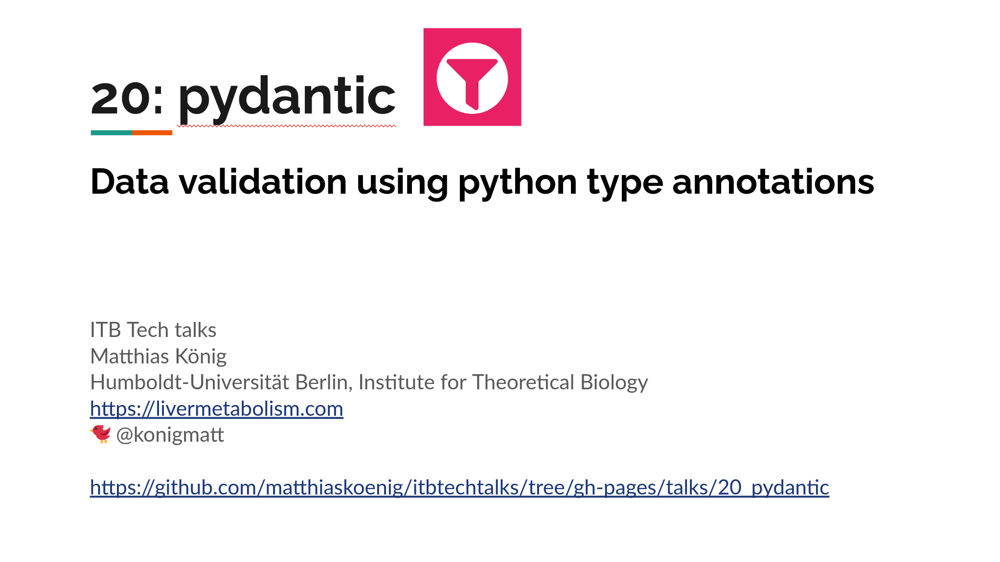

# Rich - writing rich text (with color and style)
## Presentation & video  
<a href="https://docs.google.com/presentation/d/e/2PACX-1vRN4ky-CfL6kQfwRs8be41aXG6nX6SWaGDBTmRyeS-u5ihiBmwVfgn43CMEabqZnFGsfh_51VlncCLP/pub?start=false&loop=false&delayms=3000" target="_blank">
    
</a>
  
<a href="https://youtu.be/aW4BWvoT9gQ" target="_blank">
    
</a>

## Setup environment
To run the examples 
```
cd ./talks/20_pydantic
mkvirtualenv pydantic --python=python3
(pydantic) pip install -r requirements.txt
```
For detailed installation instructions see
https://pydantic-docs.helpmanual.io/install/


Install the virtualenv as a kernel for the notebook
```
(pydantic) ipython kernel install --user --name=pydantic
```


## Run example notebook
```shell
jupyter lab pydantic_example.ipynb
```
