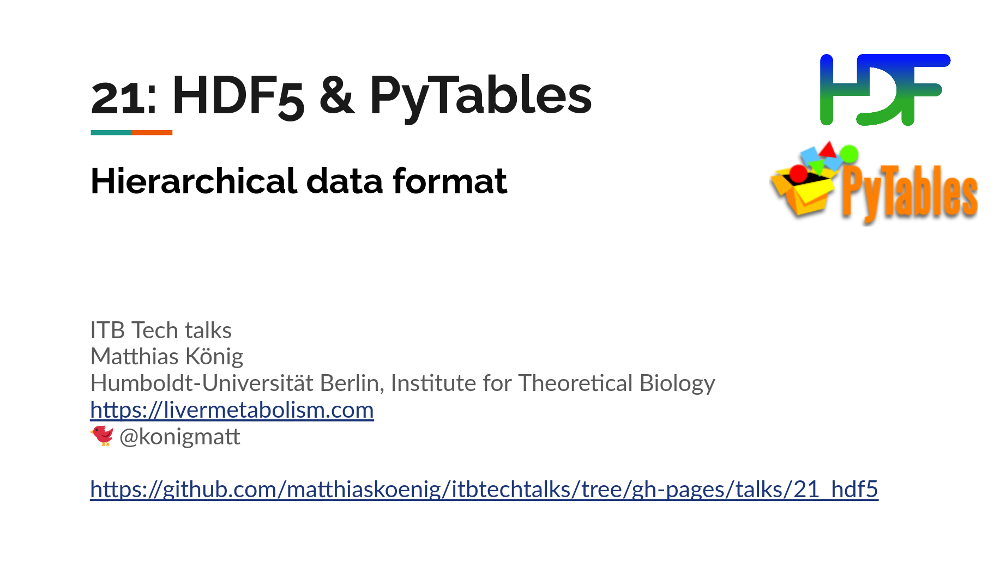
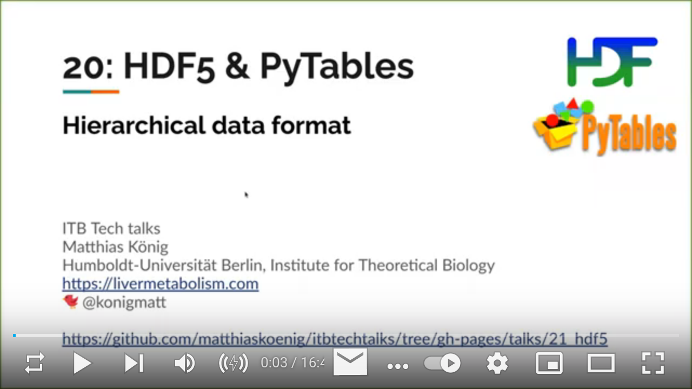

# Rich - writing rich text (with color and style)
## Presentation & video  
<a href="https://docs.google.com/presentation/d/e/2PACX-1vQj1zUsJSaCvcMoHoUX5n6hagFRAi3Wom20VYVt73qwAgdk3ENKoA97zjHaIN6R6vMER1wQZ4RXdZYK/pub?start=false&loop=false&delayms=3000" target="_blank">
    
</a>
  
<a href="https://youtu.be/RhXai1pTqrQ" target="_blank">
    
</a>

## Setup environment
To run the examples 
```
cd ./talks/21_hdf5
mkvirtualenv hdf5 --python=python3
(hdf5) pip install -r requirements.txt
```
For detailed installation instructions see
https://www.pytables.org/usersguide/installation.html 


Install the virtualenv as a kernel for the notebook
```
(hdf5) ipython kernel install --user --name=hdf5
```

## Run example notebook
```shell
jupyter lab pytables_example.ipynb
```
